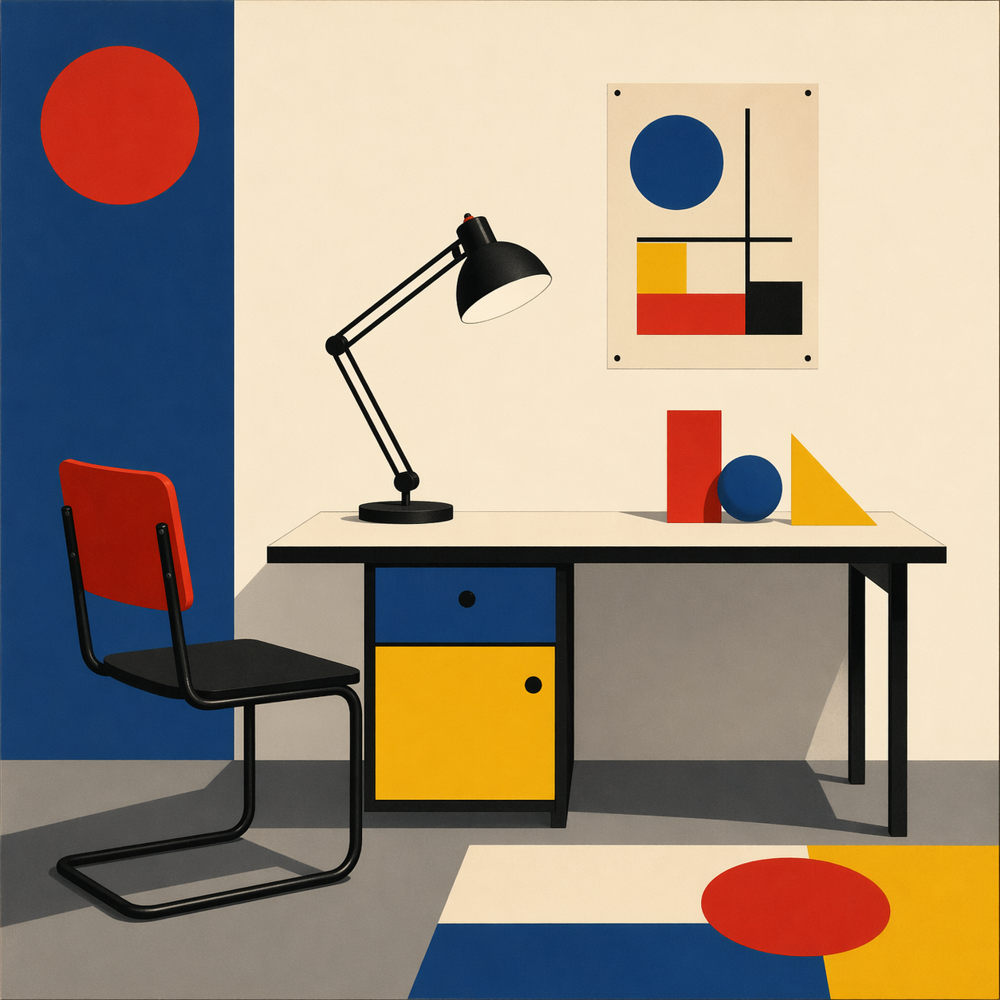
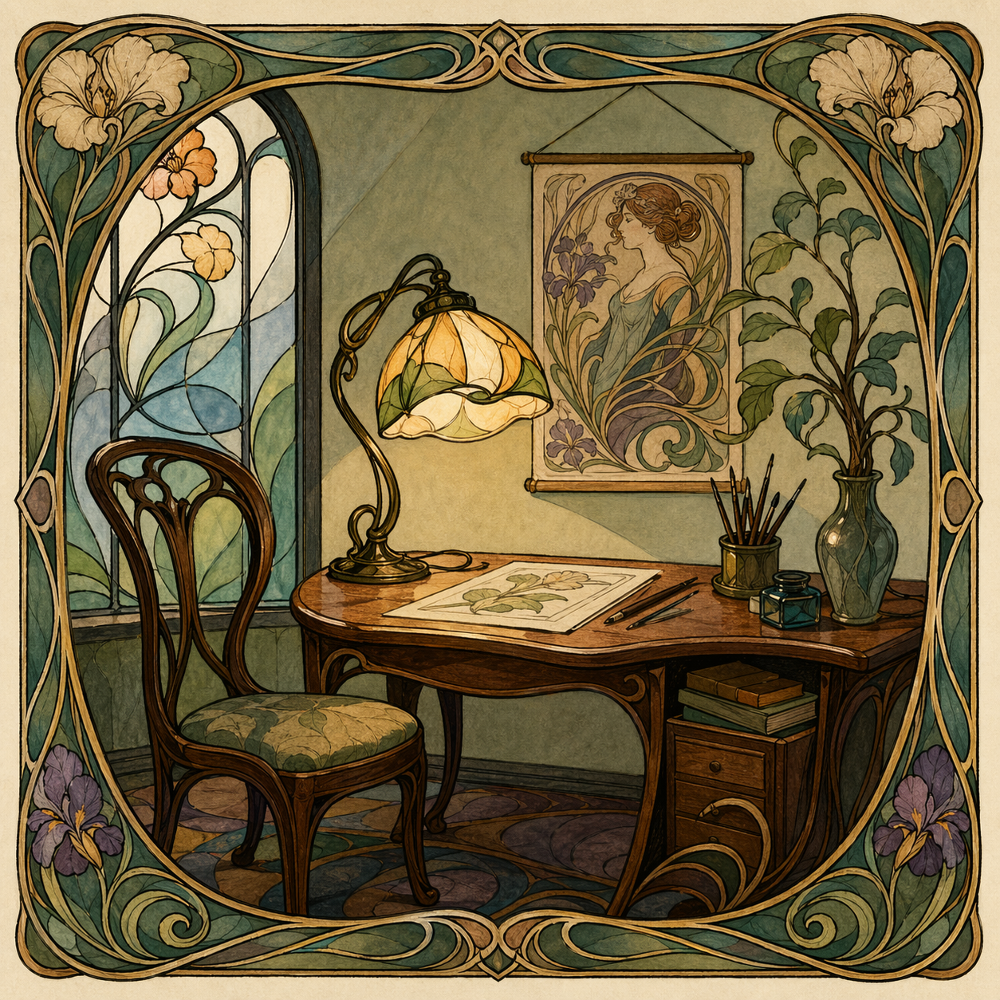
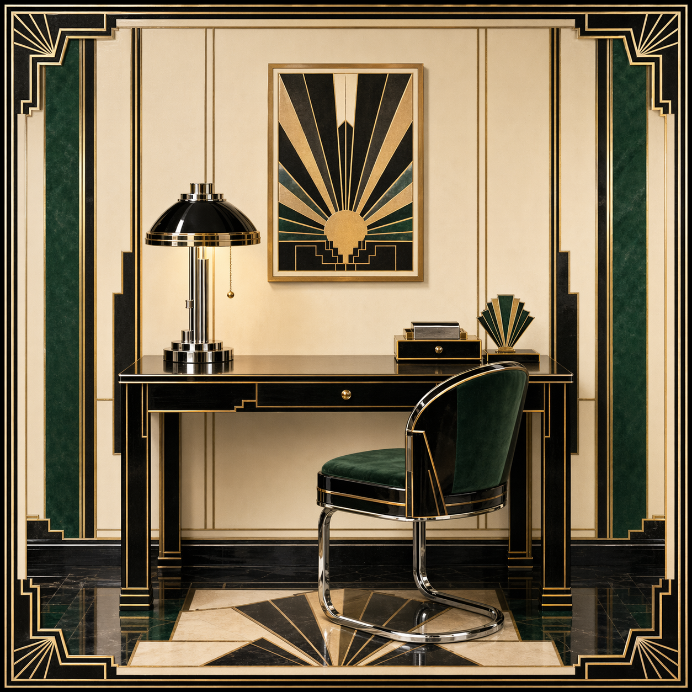
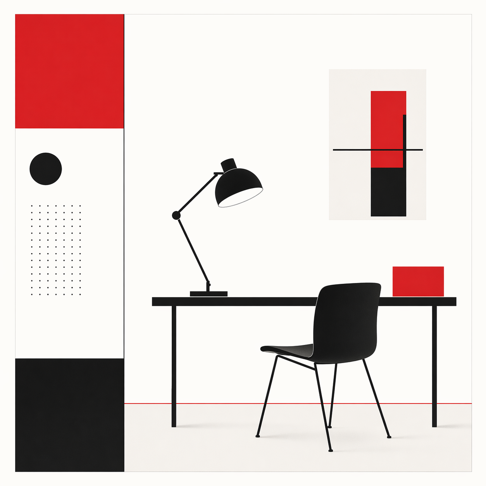
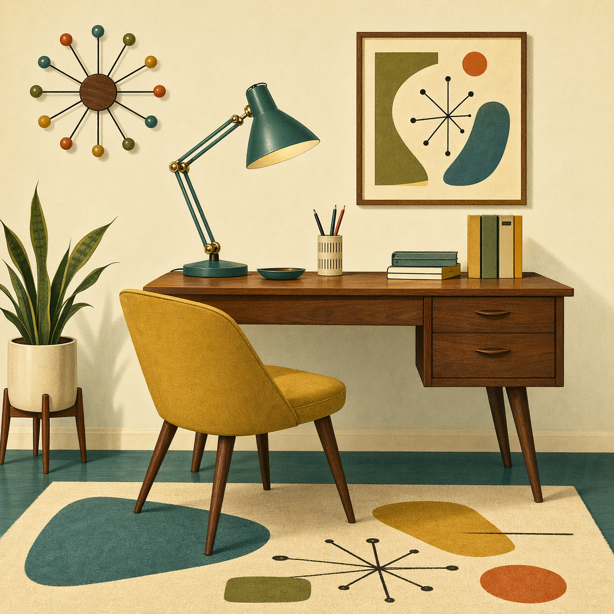
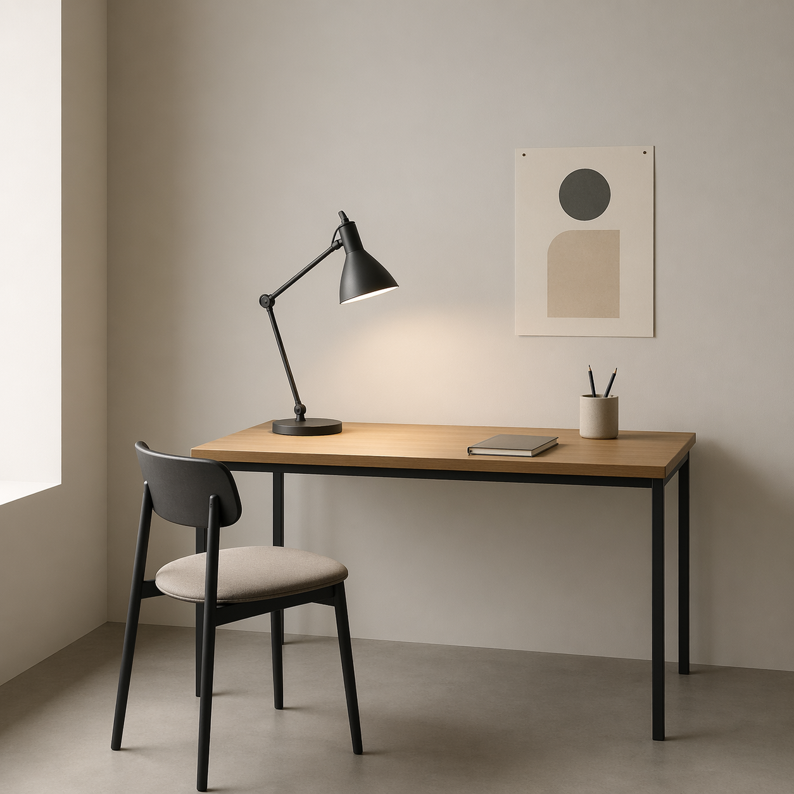
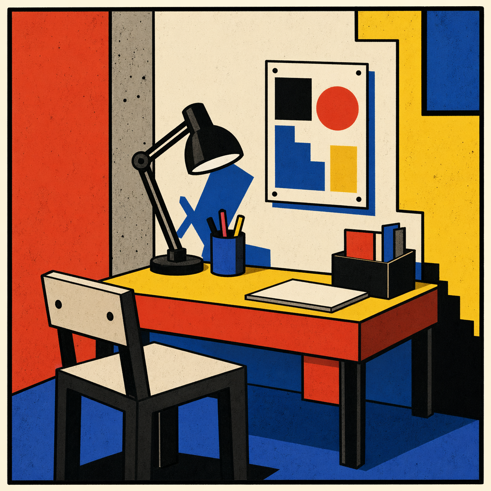
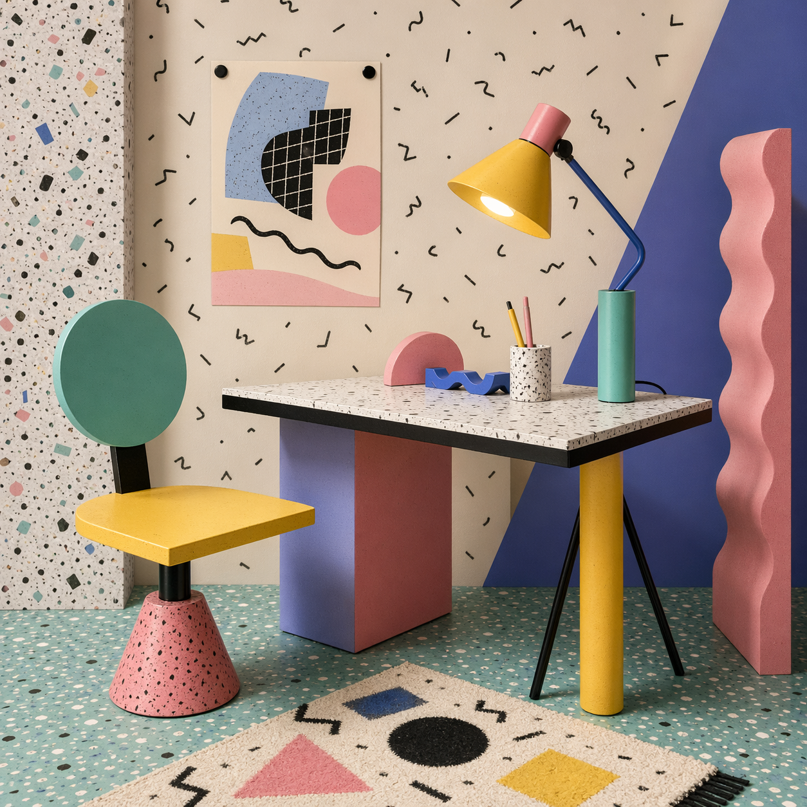
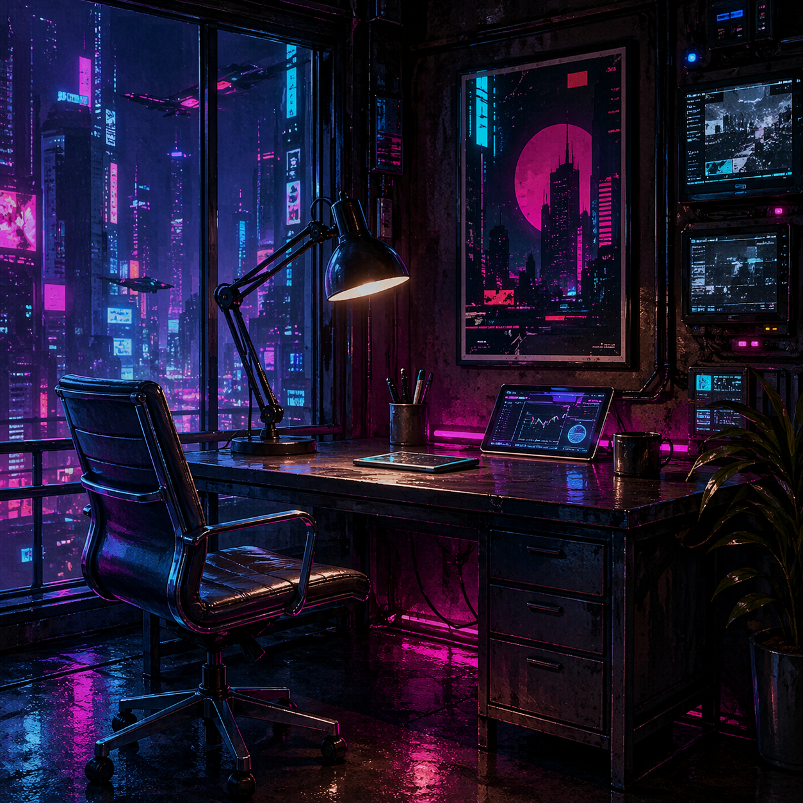
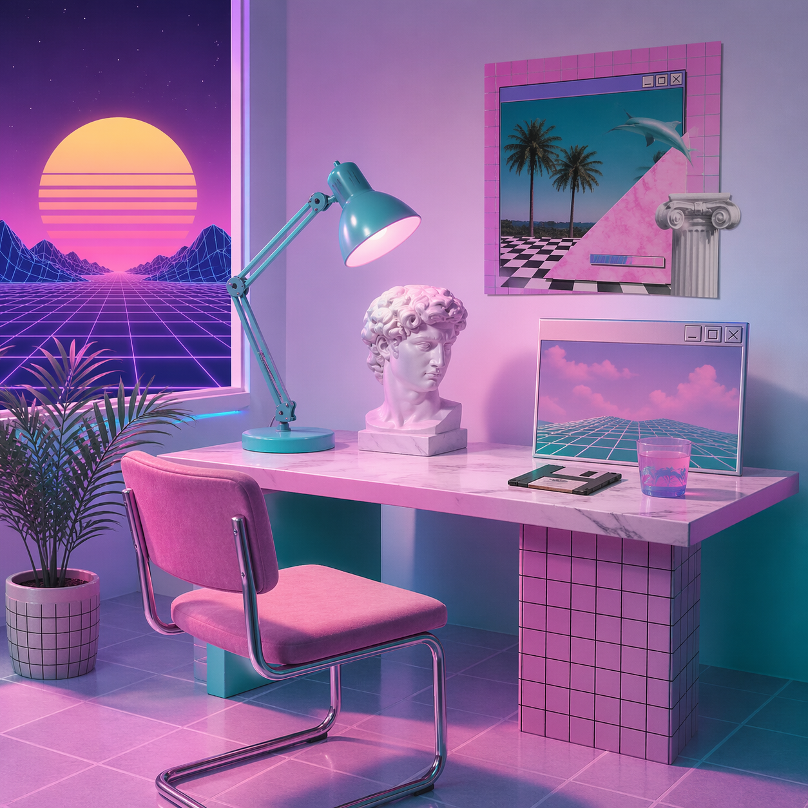

# 10 Famous Design Style Examples

These are the first ten demo slots. The prompts are designed around one repeated subject so the style differences are easy to compare:

`a square visual workbook plate showing a desk lamp, chair, small wall poster, and simple table in a compact design studio vignette`

## 01 Bauhaus



**Prompt used**

```text
Create a square visual workbook plate showing a desk lamp, chair, small wall poster, and simple table in a compact design studio vignette in Bauhaus style: primary shapes, rational composition, geometric sans-serif feeling without readable text, red-yellow-blue accents, clean planes, balanced asymmetry, functional modernism. No logos, no watermark, no readable text.
```

## 02 Art Nouveau



**Prompt used**

```text
Create a square visual workbook plate showing a desk lamp, chair, small wall poster, and simple table in a compact design studio vignette in Art Nouveau style: flowing whiplash curves, botanical linework, elegant ornamental frame, stained-glass color, graceful asymmetry, hand-crafted decorative feel. No logos, no watermark, no readable text.
```

## 03 Art Deco



**Prompt used**

```text
Create a square visual workbook plate showing a desk lamp, chair, small wall poster, and simple table in a compact design studio vignette in Art Deco style: stepped geometry, sunburst motifs, black lacquer, ivory, gold, emerald, chrome, symmetrical luxury, sleek 1920s glamour. No logos, no watermark, no readable text.
```

## 04 Swiss International



**Prompt used**

```text
Create a square visual workbook plate showing a desk lamp, chair, small wall poster, and simple table in a compact design studio vignette in Swiss International style: strict grid, asymmetric alignment, clear hierarchy, generous white space, neutral grotesk typography feeling without readable text, black-red-white palette, objective modernist clarity. No logos, no watermark, no readable text.
```

## 05 Mid-Century Modern



**Prompt used**

```text
Create a square visual workbook plate showing a desk lamp, chair, small wall poster, and simple table in a compact design studio vignette in Mid-Century Modern style: clean functional forms, tapered wood, atomic motifs, warm walnut, mustard, olive, teal, cream, optimistic postwar domestic modernity. No logos, no watermark, no readable text.
```

## 06 Minimalism



**Prompt used**

```text
Create a square visual workbook plate showing a desk lamp, chair, small wall poster, and simple table in a compact design studio vignette in minimalist style: radical reduction, clear negative space, few elements, restrained palette, precise proportion, quiet materials, calm hierarchy, everything purposeful. No logos, no watermark, no readable text.
```

## 07 Neo-Brutalism



**Prompt used**

```text
Create a square visual workbook plate showing a desk lamp, chair, small wall poster, and simple table in a compact design studio vignette in neo-brutalist style: thick black outlines, loud flat color, offset shadows, blocky layout, deliberately blunt UI-like panels, playful anti-polish. No logos, no watermark, no readable text.
```

## 08 Memphis Postmodern



**Prompt used**

```text
Create a square visual workbook plate showing a desk lamp, chair, small wall poster, and simple table in a compact design studio vignette in Memphis postmodern style: playful geometric squiggles, terrazzo texture, laminate surfaces, pastel brights, black pattern marks, deliberately odd object shapes, 1980s design energy. No logos, no watermark, no readable text.
```

## 09 Cyberpunk



**Prompt used**

```text
Create a square visual workbook plate showing a desk lamp, chair, small wall poster, and simple table in a compact design studio vignette in cyberpunk style: dense neon city atmosphere, wet reflective surfaces, magenta-cyan contrast, layered screens, worn high-tech materials, surveillance-like panels without readable text, deep night shadows. No logos, no watermark, no readable text.
```

## 10 Vaporwave



**Prompt used**

```text
Create a square visual workbook plate showing a desk lamp, chair, small wall poster, and simple table in a compact design studio vignette in vaporwave style: pastel pink and cyan, marble bust-inspired forms, grid horizon, retro computer windows, low-poly sunset, nostalgic internet collage. No logos, no watermark, no readable text.
```

